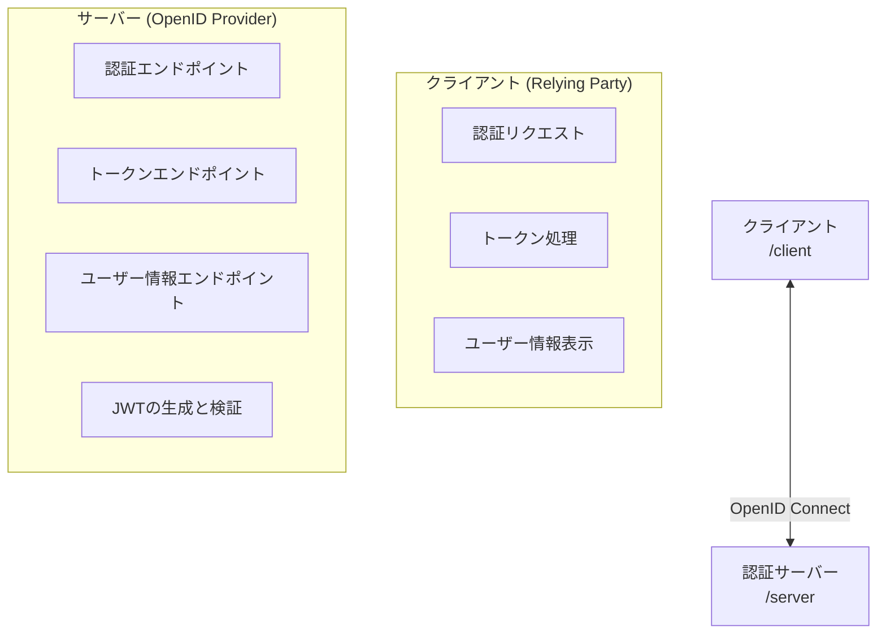
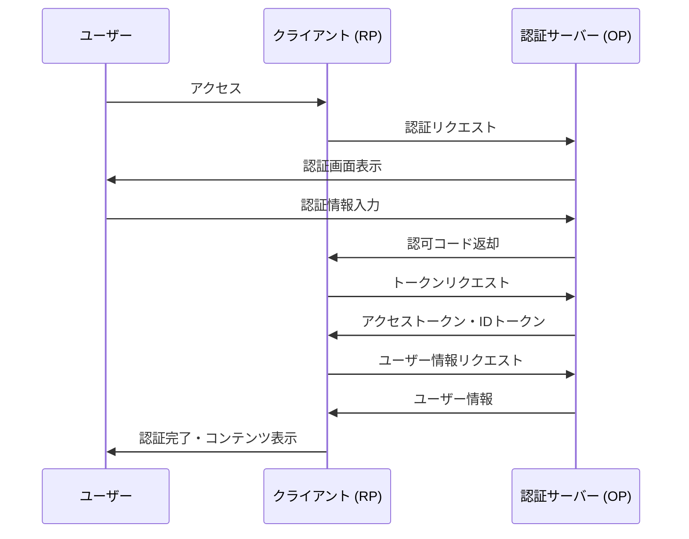

# システムパターン

## 全体アーキテクチャ
このプロジェクトは、OpenID Connectプロトコルに基づいたクライアント・サーバーアーキテクチャを採用しています。

## 設計原則
1. **シンプルさ優先**: 学習目的のため、複雑な実装よりも理解しやすさを重視
2. **最小依存**: セキュリティ関連を除き、可能な限り外部ライブラリに依存しない
3. **モジュール分割**: 責務に応じた明確なモジュール分割
4. **テスト駆動**: 機能の正確性を確保するためのテスト重視
5. **自己完結性**: ローカル環境のみで完結する設計

## コンポーネント構成

### クライアント側 (/client)
- **認証クライアント**: OpenID Connect RPとしての機能を実装
- **状態管理**: 認証状態やトークンの管理
- **UI**: ユーザーインターフェース（ログイン/ログアウト、プロフィール表示など）
- **ストレージ**: トークンやセッション情報の保存（SQLite3）

### サーバー側 (/server)
- **認証サーバー**: OpenID Connect OPとしての機能を実装
- **エンドポイント管理**: 各種エンドポイントの実装と処理
- **トークン生成**: JWTトークンの生成と署名
- **ユーザー管理**: ユーザー情報の管理（SQLite3）

## データフロー

### 認証フロー

## 技術的決定事項
1. **JWT実装**: セキュリティ重視のため、専用ライブラリ（jose）を使用
2. **データベース**: シンプルさと可搬性のため、SQLite3を採用
3. **TypeScript**: 型安全性と開発効率のため採用
4. **モノレポ構成**: 関連コードの管理を容易にするため採用

## セキュリティ考慮事項
- JWTの適切な署名と検証
- CSRF対策の実装
- 適切なスコープ管理
- セキュアなトークン保存
- TLS通信（ローカル環境のため自己署名証明書）

## 拡張性
- 追加認証方式の実装が容易な設計
- スコープの拡張が可能
- クレームの追加・カスタマイズが可能
- 異なるクライアントアプリケーションへの対応
